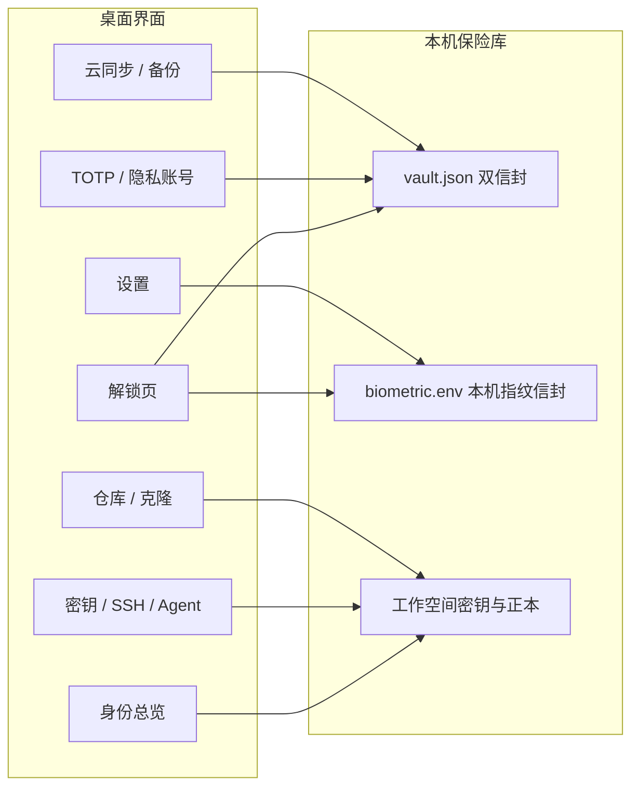
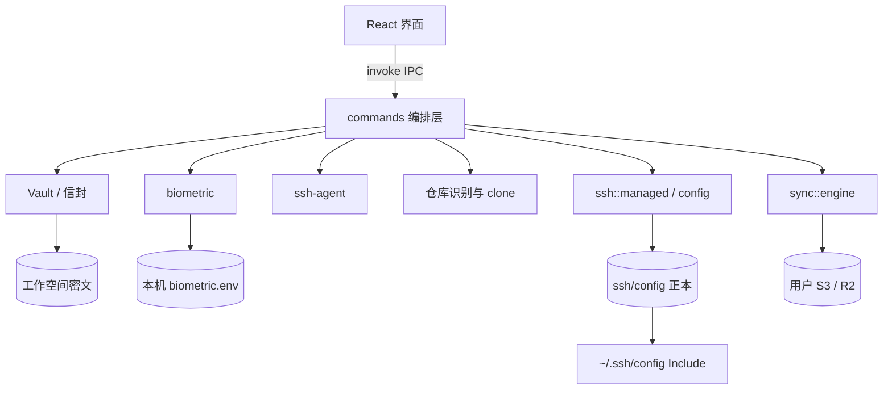

# 御钥师 (Git Keymaster)

仓库：[ice-juice/git-keymaster-app](https://github.com/ice-juice/git-keymaster-app)

> **本地加密的 Git 多身份工作站**：把 SSH 密钥、Host 别名、ssh-agent、提交身份、仓库归属、2FA 与隐私账号收进同一套保险库，在 Windows / macOS / Linux 上开箱使用。

从旧版 `git-account-manager` 升级时，请先按 [标识重命名与数据迁移](docs/标识重命名与数据迁移.md) 备份再安装，避免找不到工作空间。

---

## 为什么需要它

同一台电脑上同时用个人号、公司号、外包号或自建 Git 时，手工维护很容易出错：

- 密钥命名混乱，口令记在不安全的地方
- `~/.ssh/config` 漏配 `IdentitiesOnly yes`，认证串号或被平台拉黑
- Windows 上 `ssh-agent` 停了就要重新输口令
- 仓库忘了设局部 `user.name` / `user.email`，商业提交挂上个人邮箱
- 换机时私钥拷贝不安全，也没有系统级加密备份

御钥师把「一个 Git 身份」当成可管理对象：密钥、别名、agent、提交身份、关联仓库都在一个界面里，并能一键体检和修复。密钥与机密只在本机加密保管；云同步只把密文放到**你自己的** S3 / R2，我们不运营中心服务器。

---

## 核心特性全景

### 1. 本地加密工作空间

- **双信封 + 本机指纹信封**：数据由随机 256 位主密钥（MK）保护。MK 分别被访问密码、恢复密钥封装；开启指纹后，本机再增加一份硬件绑定信封（不进云同步）。
- **Argon2id + XChaCha20-Poly1305**：加解密在 Rust 内存中完成，用完 `zeroize` 清零。
- **会话宽限期**：可设开机免验证天数；「立即锁定」只清内存中的 MK，不会自动再弹指纹。

### 2. 指纹 / 生物识别解锁

- **Windows**：Windows Hello（指纹 / 面部 / PIN），TPM 绑定。
- **macOS**：Touch ID / 系统生物识别（Keychain ACL）。
- **Linux**：v1 不提供指纹解锁，请用密码或恢复密钥。
- 解锁页优先指纹，可手动改用密码或恢复密钥；锁定后需用户主动点指纹图标，不会自动唤醒传感器。
- 查看 TOTP / 隐私密码也可选指纹重认证；导出 TOTP 原始密钥默认仍要访问密码。

### 3. 身份总览与体检

- 每项身份显示密钥、SSH 配置、agent 驻留、远程 `ssh -T` 四维状态。
- 单项或批量连通性测试，确认免密认证是否指向正确账号。
- 改别名时检查已绑定仓库，避免断链。

### 4. SSH 密钥与配置

- 一键生成 Ed25519，或导入已有私钥；口令由保险库托管。
- 私钥投放到工作空间受控目录，Windows 用 `icacls` 收紧权限。
- 只改 `# ===== BEGIN/END managed by git-keymaster =====` 区块，区块外手写内容保留。
- `~/.ssh/config` 以 Include 指向工作空间正本，系统入口与正本分离。

### 5. ssh-agent 托管

- 解锁后自动把私钥注入 agent，日常 `git push/pull` 不必反复输密。
- 探测本机 OpenSSH / Git 自带工具链，按平台选择可用二进制。

### 6. 仓库管理与智能克隆

- 识别 HTTPS、SSH、浏览器地址、`owner/repo`，按归属标识推荐身份并改写成 Host 别名。
- 集中管理已绑定仓库：打开目录、检查远程、切换身份。
- 克隆或初始化后写入正确的 `user.name` / `user.email`。

### 7. 2FA / TOTP 与隐私账号

- TOTP 密钥加密存放，支持手动、otpauth URI、图片、屏幕扫码导入。
- 隐私账号按平台聚合，密码二次验证、历史版本、可联动 TOTP。
- 复制到系统剪贴板后按设置秒数自动清空。

### 8. 离线备份与云同步

- **离线**：导出 `.gambackup`，独立备份密码，换机预览后合并还原。
- **云同步**：兼容 Cloudflare R2、AWS S3、MinIO 等 S3 API；出机即密文，对象名 HMAC 混淆；先传对象再提交 Manifest。
- 多端按身份 id 合并；SSH 正本按 alias 去重，避免恢复后 Host 重复。

### 9. 网络、更新与环境自查

- HTTP / HTTPS / SOCKS5 代理，更新、GitHub API、Git HTTPS、SSH、云同步共用。
- 从 GitHub Release 检查并安装更新（需签名校验）。
- 设置页可检查本机安全环境；单实例运行，第二个窗口会先通知已开实例锁定再退出。

---

## 功能地图

侧栏对应的能力如下。设置与「立即锁定」在侧栏底部。

```text
解锁工作空间
    ├─ 指纹 / Windows Hello / Touch ID（需在设置中开启）
    ├─ 访问密码
    └─ 恢复密钥 GAM1-...
         │
         ▼
身份总览 ──────── 密钥、Config、Agent、ssh -T 体检
密钥管理 ──────── 生成 / 导入 / 部署 / 权限
SSH 配置 / 编辑 ── 工作空间正本 + 健康检查 + Diff
Agent ─────────── 加载 / 卸载 / 状态
仓库管理 ──────── 扫描、切换远程、打开目录
克隆仓库 ──────── 地址识别 → 选身份 → clone / 初始化
2FA / TOTP ────── 导入、查看验证码、取回密钥
隐私账号 ──────── 平台账号、密码、历史、联动 TOTP
云端同步 ──────── 推送 / 拉取 / 快照恢复 / 离线备份
设置 ──────────── 安全（指纹、宽限期）、代理、更新、主题
立即锁定 ──────── 清内存 MK，回到解锁页（不自动验证）
```



---

## 技术框架与架构

| 层 | 技术 |
|---|---|
| 桌面壳 | Tauri 2（WebView + 系统托盘） |
| 界面 | React 19、TypeScript、Vite、Zustand |
| 后端 | Rust：保险库、SSH、同步、指纹 IPC |
| 加密 | Argon2id、XChaCha20-Poly1305、HKDF、zeroize |
| 指纹 | Windows Hello `KeyCredentialManager` + TPM；macOS Keychain / LocalAuthentication |
| 云同步 | 自研 S3 SigV4 客户端，用户自备存储桶 |
| 安装包 | Windows NSIS / MSI；macOS Universal DMG；Linux AppImage / deb / rpm |



安全边界：

- 前端不接触私钥、访问密码、MK 明文。
- 指纹信封只写本机状态目录，不进 `vault.json`，不上传。
- 云端只有密文与 HMAC 对象名；换机用恢复密钥重建后再拉清单。

更细的设计见 `docs/`：`规划设计.md`、`密码与2FA管理设计.md`、`指纹识别解锁设计.md`、`程序更新功能设计.md`。

---

## 安装与使用

### 下载哪个文件

GitHub Release 里中英文成对出现。文件名都以 `Git.Keymaster_` 开头：

| 平台 | 推荐 | 说明 |
|---|---|---|
| Windows | `*_x64_zh-CN-setup.exe` | NSIS 安装向导；`zh-CN` 中文，`en-US` 英文 |
| Windows | `*_x64_*.msi` | 可选 |
| macOS | `*_universal_zh-CN.dmg` | Intel 与 Apple Silicon 同一包 |
| Linux | `*_amd64_zh-CN.AppImage` | 应用内更新只支持 AppImage |
| Linux | `.deb` / `.rpm` | 请用系统软件包更新 |

同名 `.sig` 和 `*.app.tar.gz` 给应用内更新用，一般不用手动下载。

从旧标识升级：先读 [标识重命名与数据迁移](docs/标识重命名与数据迁移.md)。工作空间目录不会跟着安装包走，卸程序通常不会删保险库。

### Windows

1. 运行 `Git.Keymaster_*_x64_zh-CN-setup.exe`（或 MSI）。NSIS 向导默认装到 `%LOCALAPPDATA%\GitKeymaster`，开始菜单和窗口标题仍是「御钥师」。
2. 首次启动选择或创建工作空间，记下 **恢复密钥**。
3. 需要指纹时：先在 Windows 设置里登记 Hello，再在御钥师「设置 → 安全」用访问密码开启指纹解锁。
4. 本机需有 OpenSSH 客户端（Windows 可选功能或 Git for Windows）。

### macOS 如何正确安装

当前安装包**未做 Apple 公证**时，Gatekeeper 会拦截首次打开，这是预期行为，不是文件损坏。

1. 只下载 **Universal DMG**（`Git.Keymaster_*_universal_zh-CN.dmg` 或 `en-US`）。不要把 `*.app.tar.gz` 当安装包。
2. 打开 DMG，把「御钥师」拖到「应用程序」。不要从 DMG 里直接长期运行。
3. 第一次打开：
   - 在启动台或「应用程序」里找到御钥师；
   - **按住 Control 再点图标**（或右键）→ 选择「打开」→ 确认「打开」；
   - 或打开「系统设置 → 隐私与安全性」，在被拦截提示旁点「仍要打开」。
4. 若提示「已损坏，无法打开」，多半是隔离属性，在终端执行（路径按实际应用名调整）：

```bash
xattr -dr com.apple.quarantine /Applications/御钥师.app
```

英文包名称可能是 `Git Keymaster.app`，把路径换成实际名字即可。

5. 若仍无法打开：确认下载完整、来自本仓库 Release，不要用浏览器「隔空投送」过程中被二次隔离的残缺拷贝。
6. 指纹：先在「系统设置 → 触控 ID 与密码」登记指纹，再在御钥师设置里开启。换指纹或关闭 Touch ID 后需重新开启。
7. SSH：使用系统或 Homebrew 的 `ssh` / `ssh-add`。首次 `ssh -T` 仍可能询问主机指纹，在终端确认即可。

之后可用应用内「检查更新」。更新包是 `.app.tar.gz`，由程序自己替换，不必手装。

### Linux

- **AppImage**：`chmod +x` 后运行。应用内更新只支持这种形态。
- **deb / rpm**：用发行版软件库方式更新，不要指望应用内自更新。
- 屏幕扫码未编入部分发行版构建，请用图片或 otpauth URI 导入 TOTP。
- 指纹解锁 v1 不可用。

### 使用说明（第一次）

1. 创建工作空间，设置访问密码，**立刻保存恢复密钥**（`GAM1-...`）。丢了密码又丢了恢复密钥，密文无法找回。
2. 新建身份：平台、提交姓名/邮箱、生成或导入密钥，按提示把公钥加到 GitHub / GitLab。
3. 在「身份总览」跑一遍连通性；在「克隆仓库」用别名地址克隆，或把已有仓库扫进来。
4. 需要换机：配置自己的 S3 / R2 并推送一次；新机器用恢复密钥重建工作空间再拉取。也可使用离线 `.gambackup`。
5. 可选：设置里开启指纹、代理、开门动画、免验证天数。

### 注意事项

- **恢复密钥比密码更关键**。不要只存在这台电脑的备忘录里。
- **指纹不能换机、不能当唯一备份**。重装系统、换指纹、清 TPM / Keychain 后必须用密码或恢复密钥，再到设置里重新开启指纹。
- **「立即锁定」不会自动解锁。** 离开座位请锁定；回来再点指纹或输入密码。
- 只改托管区块。不要把手写 Host 和托管别名写成同一个名字，健康检查会报重复。
- 云同步是零知识：我们看不到内容，也帮不了「没恢复密钥」的找回。
- 严格模式：磁盘不留可复制的私钥，只在解锁后把密钥放进 agent；丢了工作空间且没有备份就无法再导出私钥。
- 不要同时开两个不同版本指向同一工作空间。
- 开发调试请在仓库 `app` 目录执行 `npm run tauri dev`（开发模式）。

---

## 从源码运行

- 操作系统：Windows 10/11、macOS 12+、主流 Linux（打包以 CI 矩阵为准）
- Node.js >= 20、Rust >= 1.77.2
- Windows 还需 Visual Studio C++ 桌面生成工具

```bash
git clone https://github.com/ice-juice/git-keymaster-app.git
cd git-keymaster-app/app
npm install
npm run tauri dev
```

```bash
cd src-tauri
cargo test
```

生产安装包由 GitHub Actions 在 `release` 分支的 `v*` 标签上构建。本地 Windows 可打 NSIS：

```bash
cd app
npx tauri build --bundles nsis
```

发版步骤见 [发布新版本流程](docs/发布新版本流程.md)。日常开发在 `dev`，验证后再合并 `release`。

---

## 安全常见问题

**忘记访问密码？**  
用初始化时保存的恢复密钥解锁并重设密码。没有恢复密钥则无法解密。

**为什么要自己准备 R2 / S3？**  
数据只放在你的桶里。Cloudflare R2 有免费额度且出站流量通常为零，适合做加密异地备份。

**严格模式和普通模式？**  
普通模式：加密私钥在工作空间，再部署到 `ssh-keys/` 供 OpenSSH 使用。  
严格模式：磁盘只留公钥，解锁后注入 agent，降低私钥被整份拷走的风险。

**指纹丢了或换了电脑？**  
用密码或恢复密钥进入，在设置里关闭再重新开启指纹。云端不会同步指纹信封。

---

## 许可证

Copyright © 2026. All rights reserved.
