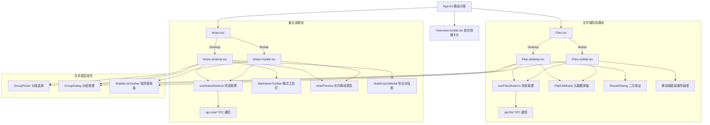
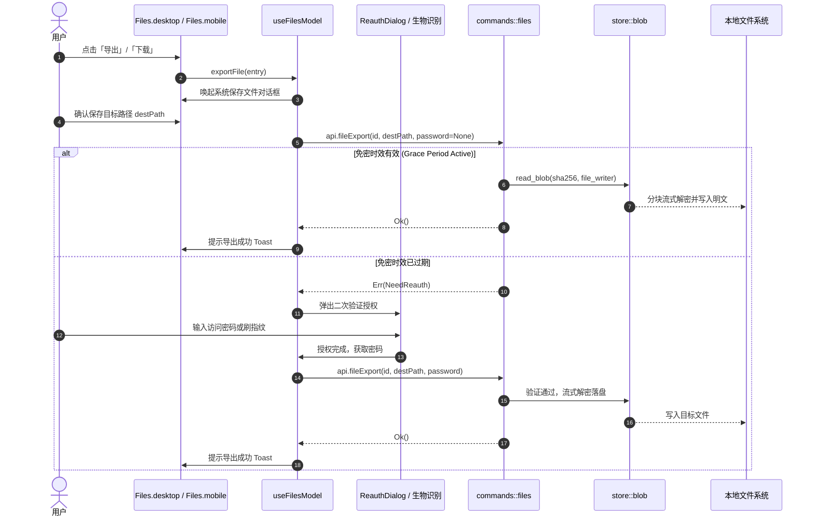
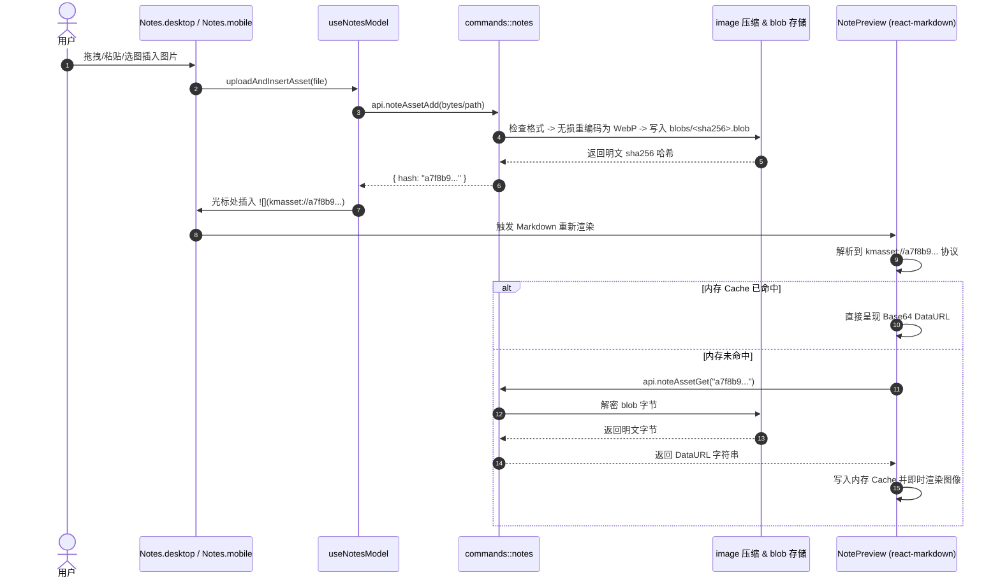

# 文件保险库与备忘录设计

> 配套文档：`规划设计.md`（保险库总体架构）、`密码与2FA管理设计.md`（元数据/机密分离铁律）、`移动端App开发计划.md`（四端分层）、`程序更新功能设计.md`、`网络代理设置设计.md`
> 本文定位：在现有本机加密保险库之上，新增两个消费级模块——**文件保险库（加密文件柜）**与**备忘录（图文笔记）**，复用同一套加密、二次验证、云同步与四端分层基建。
> 制定日期：2026-09-15 · 基线版本：v1.6.0 · 基线分支：`dev`
> 状态：P1 落地中（数据模型 + 分块加密 blob 库 + 单测）

---

## 第一部分 · 目标与范围

### 1.1 要解决什么

保险库已经在托管 SSH 密钥、Git 身份、TOTP、隐私账号密码。用户还有两类高敏感数据无处安放：

| 模块 | 用户诉求 |
|---|---|
| 文件保险库 | 把身份证/护照扫描件、密钥备份、授权书、恢复码截图等**任意类型文件**当作附件加密存进保险库，可自定义名称与备注、随身、随时取回、跟着云同步走 |
| 备忘录 | 用 Markdown 记录带图的私密笔记（服务器信息、账号线索、操作手册），图文一起加密保存，图片无损压缩省容量 |

两者与现有模块高度同构：**存密文 → 分组检索 → 二次验证后取用 → 云同步**。因此第一原则依旧是**最大化复用现有基建**（`vault` 加密栈、`store` 持久化、`sync::engine` 零知识同步、图标体系、reveal 免密时效、四端能力矩阵）。

### 1.2 功能目标

#### 模块一：文件保险库

| 编号 | 目标 |
|---|---|
| F1 | 上传任意类型文件（图片/PDF/文本/压缩包等）作为**附件**存入保险库，PC 与移动端都可上传 |
| F2 | 每个文件可填**自定义名称**与**备注说明**；同时**保留原始文件名**（导出时默认用原名） |
| F3 | 全量密文落盘；**单文件上限 100 MB，总容量不设上限**（顶部展示已用量，仅作提示不拦截总量） |
| F4 | 列表只显示元数据（自定义名/原名、类型、大小、时间、备注、分组、图标），不解密内容 |
| F5 | 随时**还原取回**：导出到用户选定路径（桌面文件对话框 / 移动端分享或保存），默认用原始文件名 |
| F6 | 分组管理、快速检索（自定义名/原名/备注/分组/类型多词匹配） |
| F7 | 查看 / 导出文件前需**访问密码二次验证**（吃免密查看时效） |
| F8 | 跟随现有**云同步**上传（增量、去重、端到端加密），换机可还原；删除打墓碑并多端传播 |

#### 模块二：备忘录

| 编号 | 目标 |
|---|---|
| N1 | 新建 / 编辑 Markdown 备忘（v1 以 Markdown 为主，带实时预览工具栏） |
| N2 | **图文混排**：插入本地图片，图片单独加密存储、正文按引用拼装 |
| N3 | 插入图片时**无损压缩**（位图转无损 WebP），减轻容量负担 |
| N4 | 标题、分组、标签、自定义图标、置顶、组内排序 |
| N5 | 列表显示标题 + 摘要，快速检索（标题/标签/分组/摘要匹配） |
| N6 | 正文与图片全量加密落盘，跟随云同步；正文改动只重传变化的对象 |
| N7 | 导出为 `.md`（可选内联图片或打包 zip），便于迁移 |

### 1.3 非目标（本期不做）

- 不做断点续传的分片多段上传（单对象 PUT 足够）；单文件硬上限 100 MB，超大文件请用专业网盘。
- **总容量不设上限**：由用户自负容量与云端费用；程序只展示已用量并做好增量/去重/流式，尽量降低负担。
- 不做在线预览所有文件类型；导出后交给系统默认应用打开（桌面可选"临时解密后打开"，见 §7）。
- 备忘录 v1 不做完整所见即所得（WYSIWYG）富文本；先做 Markdown 源码 + 实时预览 + 图片插入。TipTap/富文本作为 P2 增强项。
- 备忘录图片对已是有损压缩的照片（JPEG）不二次转码（避免劣化或体积反增），只对可无损优化的位图压缩。
- 不做多人协作 / 版本分支；备忘录只保留"最后一次"正文（历史版本作为后置增强项）。
- 不做全文检索索引（走内存模糊匹配即可，条目数量级不大）。

---

## 第二部分 · 数据模型

### 2.1 沿用元数据 / 机密分离铁律

现有架构区分**可展示元数据**（`VaultData` / `AccountData` / `TotpData`，可跨 IPC）与**机密**（`Secrets`，只在 Rust 内存出现、绝不跨 IPC）。本设计新增第三类载体——**加密大对象（blob）**：

- **元数据**（自定义名、原名、大小、类型、备注、分组、标题、标签、图片引用列表）→ 新增两个加密元数据文件，可回前端渲染列表。
- **内容**（文件字节、备忘录正文、备忘录图片）→ **内容寻址的加密 blob**，按需解密。与密码/种子不同，文件字节和备忘录正文**必须**跨 IPC 才能导出/编辑，因此不放进 `Secrets`，而是独立的按需解密通道（类比 `totp_generate_code` 返回终值、`icon_get_custom` 返回 dataURL）。

### 2.2 新增结构（`model/mod.rs`）

```rust
/// 文件保险库条目（元数据；密文内容按 sha256 存入内容寻址 blob 库）。
#[derive(Debug, Clone, Serialize, Deserialize, PartialEq)]
#[serde(rename_all = "camelCase")]
pub struct FileEntry {
    pub id: String,
    pub name: String,            // 自定义显示名称（用户可改）
    pub original_name: String,   // 原始文件名（含扩展名，保留；导出默认用它）
    pub mime: Option<String>,    // 猜测的 MIME，用于图标/打开方式
    pub size: u64,               // 明文字节数
    pub sha256: String,          // 明文哈希：blob 内容寻址键 + 一致性校验 + 去重
    pub group: Option<String>,
    pub note: Option<String>,    // 备注说明
    pub icon: Option<String>,    // 复用图标体系，默认按扩展名给内置图标
    pub sort_order: i32,
    pub created_at: String,
    pub updated_at: String,
}

/// data/files.enc
#[derive(Debug, Clone, Serialize, Deserialize, Default)]
#[serde(rename_all = "camelCase")]
pub struct FileData {
    pub entries: Vec<FileEntry>,
    pub groups: Vec<GroupMeta>,
    #[serde(default, serialize_with = "serde_maps::ordered_string_map")]
    pub deleted_entries: HashMap<String, String>, // id -> 删除时间（墓碑）
}

/// 备忘录条目（元数据；正文与图片单独加密）。
#[derive(Debug, Clone, Serialize, Deserialize, PartialEq)]
#[serde(rename_all = "camelCase")]
pub struct NoteEntry {
    pub id: String,
    pub title: String,
    pub format: String,          // v1 固定 "markdown"
    pub group: Option<String>,
    pub tags: Vec<String>,
    pub icon: Option<String>,
    pub pinned: bool,
    pub sort_order: i32,
    pub excerpt: Option<String>, // 列表摘要（正文前若干字，去除图片语法）
    pub body_sha256: String,     // 正文 blob 内容寻址键（正文改则变）
    pub asset_hashes: Vec<String>, // 正文引用到的图片 sha256，供同步与 GC
    pub created_at: String,
    pub updated_at: String,
}

/// data/notes.enc
#[derive(Debug, Clone, Serialize, Deserialize, Default)]
#[serde(rename_all = "camelCase")]
pub struct NoteData {
    pub entries: Vec<NoteEntry>,
    pub groups: Vec<GroupMeta>,
    #[serde(default, serialize_with = "serde_maps::ordered_string_map")]
    pub deleted_entries: HashMap<String, String>,
}
```

> 复用现有 `GroupMeta` 与 `serde_maps::ordered_string_map`（保证 JSON 键序稳定、云端清单哈希可比对）。

### 2.3 多端合并（`model/mod.rs`）

比照 `merge_totp_data` / `merge_account_data`，新增：

- `merge_file_data(local, remote)`：条目按 `updated_at` 取新，墓碑传播删除，分组按名并集。
- `merge_note_data(local, remote)`：同上。
- blob 本身是**内容寻址、不可变**（同 sha256 内容永远相同），因此不需要冲突合并——只需保证被引用的 blob 都在。

删除的墓碑与现有身份/账号一致：`deleted_entries: id -> ts`，拉取时把对端已删的条目真正去掉。

---

## 第三部分 · 加密与存储

### 3.1 目录布局（工作空间内新增）

```text
<工作空间>/
├── data/
│   ├── files.enc        # FileData（LABEL_METADATA 加密）
│   └── notes.enc        # NoteData（LABEL_METADATA 加密）
├── blobs/               # 内容寻址加密大对象（文件内容 / 备忘录正文 / 备忘录图片）
│   └── <sha256>.blob    # 分块 AEAD 帧格式，LABEL_FILE_BLOB 加密
└── ...（keys/ icons/ sync/ 等保持不变）
```

- **内容寻址**：blob 以**明文 sha256**命名，天然去重（相同文件/图片只存一份），且快照与云同步都只引用哈希、不复制字节。
- 备忘录正文也是一个 blob（`body_sha256`）；正文一改就是新哈希、新 blob，旧 blob 由 GC 回收。

### 3.2 新增子密钥标签（`vault/crypto.rs`）

标签"一经发布不可更改"，新增一个向前兼容的标签：

```rust
/// 文件保险库 / 备忘录 blob 内容加密（v1.6）
pub const LABEL_FILE_BLOB: &[u8] = b"gam-file-blob-v1";
```

blob 用 `master_key.subkey(LABEL_FILE_BLOB)` 加密。云端对象名沿用现有 HMAC（`LABEL_SYNC_NAME`），内容加密沿用 `LABEL_SYNC_OBJECT`——见 §4 对"是否二次加密"的取舍。

### 3.3 分块流式加密（关键：约束内存）

现有 `store::seal/open` 是**整块**加密（一次性读进内存）。100 MB 文件在**移动端**整块进内存不可接受。新增**分块帧格式**，把内存占用钉在"一个分块"级别：

```text
文件头:  magic(4="GKB1") || version(1) || chunk_size(u32 LE, 默认 1 MiB)
分块*:   [ nonce(24) || AEAD(chunk_plain, aad = u64 chunk_index) ]  重复直到 EOF
```

- 每块独立随机 nonce；**AAD 绑定块序号**，防止重排 / 截断 / 拼接攻击。
- 读写都以 `chunk_size` 为窗口流式进行，峰值内存 ≈ 一个分块 + tag。
- 解密时校验块序号连续且以文件头声明的方式收尾（末块可短），任一块 tag 失败即整体失败。

> 落地建议：新增 `store::blob` 子模块，暴露 `write_blob(vault, reader) -> (sha256, size)`、`read_blob(vault, sha256, writer)`、`blob_exists`、`blob_path`。写入时**边读边算 sha256 边分块加密**到临时文件，最后按最终哈希 rename 就位（原子写，复用 `atomic_write` 思路）。

### 3.4 存储 API（`store/mod.rs`）

新增（与现有 `save_data/load_data`、`save_icon/load_icon` 同构）：

| 函数 | 说明 |
|---|---|
| `load_files / save_files` | `data/files.enc` ↔ `FileData` |
| `load_notes / save_notes` | `data/notes.enc` ↔ `NoteData` |
| `blob::write_blob / read_blob` | 分块流式加解密，内容寻址 |
| `blob::blob_exists(sha256)` | 存在性检查（去重 / 增量同步） |
| `list_blob_hashes()` | 枚举本地 blob，供 GC |
| `gc_unreferenced_blobs(referenced: &HashSet)` | 删除未被任何条目引用的本地 blob |

### 3.5 大小与用量（`app_config.rs`）

- **单文件上限** `attachment_per_file_limit_mb`（默认 100，设夹紧上限防手滑）。加文件前 Rust 侧校验单文件字节，超限返回 `AppError::Invalid("单个文件不能超过 100 MB")`。
- **总容量不设上限**：不做总量拦截。前端顶部展示"已用量"（遍历元数据求和），仅作提示。
- 备忘录图片计入同一"附件"统计口径展示，便于用户了解占用。

### 3.6 备忘录图片无损压缩（`commands/notes.rs`）

`note_asset_add` 在落 blob 前先做**无损优化**（复用已在依赖里的 `image` crate，含 `webp` feature）：

- **可无损优化的位图**（PNG / BMP / 无损来源）→ 解码后重编码为**无损 WebP**，通常显著缩小体积。
- **已是有损压缩的照片**（JPEG）/ 动图（GIF）/ 已是 WebP → **保持原样**，避免二次劣化或体积反增。
- 压缩在解码/编码时按需申请内存；单图受单文件 100 MB 上限约束。压缩后再算 sha256、写内容寻址 blob。

---

## 第四部分 · 云同步集成（`sync/engine.rs`）

### 4.1 现状与瓶颈

现有 `push_to_cloud` 把**所有**逻辑对象收进一个 `HashMap<String, Vec<u8>>` 再逐个加密上传；快照 `SnapshotPayload` 把私钥 base64 全量塞进单个 payload。这套对"KB 级"资产没问题，但**直接塞 100 MB blob 会爆内存、且每次推送都重传**。因总容量不设限，增量/去重/流式尤为关键。改造要点：

### 4.2 两条通道

1. **小对象通道（沿用现有）**：`data/files.json`、`data/notes.json`、备忘录正文（文本，走 `notes/<id>.json` 逻辑路径）——随现有内存路径加密上传。
2. **大 blob 通道（新增，增量 + 去重 + 流式）**：文件内容与备忘录图片。
   - 逻辑路径 `blobs/<sha256>`，云端对象名 = `obj/<HMAC(逻辑路径)>`（沿用现有命名）。
   - **增量**：若远端 manifest 已有该逻辑路径且 `sha256` 一致 → **跳过上传**（内容寻址，天然幂等）。
   - **流式**：需上传时从磁盘**流式读取本地 blob 密文**并 PUT，不整块进内存。
   - **免二次加密**：本地 blob 已用 `LABEL_FILE_BLOB` 端到端加密，换机用恢复密钥解出同一 MK → 同一子密钥即可解密。因此**直接上传本地密文字节**，云端只见密文，省去"解密再用 LABEL_SYNC_OBJECT 重加密"的双倍开销。manifest 记录明文 `sha256`、`size`、`object_name`（HMAC）。

> 取舍说明：其余小对象仍用 `LABEL_SYNC_OBJECT` 重加密以保持一致；唯独大 blob 走"直传本地密文"通道，纯粹是为省内存与带宽。两者都满足零知识（云端只有密文 + HMAC 名）。

### 4.3 清单（`SyncManifest`）扩展

`objects` 表新增 `blobs/<sha256>` 条目与 `data/files.json` / `data/notes.json` / `notes/<id>.json`。拉取时：
- 先拉元数据，算出**被引用的 blob 哈希全集**（`FileEntry.sha256` ∪ `NoteEntry.body_sha256` ∪ `NoteEntry.asset_hashes`）。
- 只下载**本地缺失**的被引用 blob（内容寻址，已存在即跳过）。

### 4.4 垃圾回收（GC）

- **本地**：条目删除或编辑（正文换哈希）后，扫描全部元数据引用集，`gc_unreferenced_blobs` 删掉没人引用的本地 blob。
- **云端**：推送时，合并后的元数据 + **保留中的快照**所引用的哈希构成"存活集"；manifest 里不在存活集的 `blobs/*` 条目删除并 `delete_object`。快照 payload 需登记其引用的 blob 哈希（廉价），避免删掉历史快照还需要的内容。

### 4.5 快照（历史版本）

`SnapshotPayload` **不内联 blob 字节**，改为记录引用哈希列表：

```rust
struct SnapshotPayload {
    // ...原有字段...
    pub file_data: FileData,
    pub note_data: NoteData,
    pub note_bodies: HashMap<String, String>, // id -> 正文（文本，可内联）
    pub blob_hashes: Vec<String>,             // 该快照引用的 blob，仅引用不复制
}
```

恢复快照时，元数据/正文直接落盘，blob 按哈希从云端 `blobs/*` 拉取（存活即命中）。这样"最近 10 份 + 每天首份"快照不会把大文件复制成 GB 级。

### 4.6 自动同步护栏

- 复用现有 `publish_after_edit` / `kick_publish`，但**大 blob 上传默认只在手动推送或整体自动同步周期执行**；单条编辑触发的即时发布只推元数据与正文文本，blob 走"下次周期"或"手动同步"，避免每加一个大文件就阻塞。
- 移动端新增设置：**"仅在 Wi-Fi 下同步附件"**（默认开）与**"附件不参与自动同步（仅手动）"**（默认关）。
- 大对象传输给前端进度事件（复用更新下载的进度事件模式），UI 显示"正在同步 3/5 个文件"。

---

## 第五部分 · IPC 命令层（`commands/`）

新增 `commands/files.rs` 与 `commands/notes.rs`，遵守"薄封装：校验 + 编排 + 结果映射，绝不把明文机密无谓外泄"。

### 5.1 文件保险库

| 命令 | 签名要点 | 鉴权 |
|---|---|---|
| `file_list` | → `{ entries, groups, usageBytes }` | 需解锁 |
| `file_add_from_path` | `(path, {name?, note?, group?})` 桌面：读盘→查单文件上限→流式加密→写 blob→登记（原名取自路径） | `ensure_writes_allowed` |
| `file_add_bytes` | `(originalName, bytes, {name?, note?, group?})` 移动端：picker 返回字节/临时文件 | `ensure_writes_allowed` |
| `file_update` | `(id, {name?, note?, group?, icon?, sortOrder?})` 改自定义名/备注/分组等 | `ensure_writes_allowed` |
| `file_delete` | `(id)` 打墓碑 + 本地 blob GC | `ensure_writes_allowed` |
| `file_export` | `(id, destPath, password?)` 二次验证后流式解密写出（默认原始文件名） | `ensure_reveal_authorized` |
| `file_save_groups` | `(groups)` | `ensure_writes_allowed` |

写操作末尾 `kick_publish(app)` 触发同步（大 blob 按 §4.6 规则）。

### 5.2 备忘录

| 命令 | 签名要点 | 鉴权 |
|---|---|---|
| `note_list` | → `{ entries, groups }` | 需解锁 |
| `note_get_body` | `(id)` → `{ format, markdown }` | 需解锁 |
| `note_upsert` | `(args{id?, title, format, tags, group, icon, pinned, markdown})` 算摘要/正文哈希、写正文 blob | `ensure_writes_allowed` |
| `note_delete` | `(id)` 打墓碑 + GC | `ensure_writes_allowed` |
| `note_asset_add` | `(bytes\|path)` → `{ hash }` 图片**无损压缩**后存 blob，返回哈希供正文插入 | `ensure_writes_allowed` |
| `note_asset_get` | `(hash)` → `dataUrl`（供预览渲染，类比 `icon_get_custom`） | 需解锁 |
| `note_save_groups` | `(groups)` | `ensure_writes_allowed` |
| `note_export` | `(id, destPath, mode)` 导出 md（内联/zip 打包图片） | `ensure_writes_allowed` |

### 5.3 命令注册与前端封装

- 在 `commands/mod.rs` 声明 `pub mod files; pub mod notes;`，并在 `lib.rs` 的 `invoke_handler` 里注册全部命令。
- `lib/ipc.ts` 补齐类型（`FileEntry` / `NoteEntry` / `FileList` / `NoteList`）与 `api.fileXxx / api.noteXxx` 封装（沿用现有 camelCase 约定）。

---

## 第六部分 · 前端 UI（四端分层与交互设计）

### 6.1 前端整体架构与组件拆分

遵循项目既有的**四端分层模型**（`.shared` 业务逻辑 + `.desktop` 桌面布局 + `.mobile` 移动端布局 + `use*Model` 响应式状态模型），UI 层实现完全平台分立，底层复用同一套 IPC、数据模型与安全校验规则。

#### 6.1.1 目录拓扑结构

```text
app/src/
├── pages/
│   ├── Files.tsx                  # 文件保险库：平台分发接入点
│   ├── Files.shared.tsx           # 文件元数据表格、卡片、用量条、编辑/上传对话框公共逻辑
│   ├── Files.desktop.tsx          # 桌面端：双视图（网格/表格）、拖拽上传区、顶部用量与工具栏
│   ├── Files.mobile.tsx           # 移动端：总览入口卡片跳转页、紧凑卡片列表、FAB 悬浮上传、抽屉面板
│   ├── Notes.tsx                  # 备忘录：平台分发接入点
│   ├── Notes.shared.tsx           # 编辑器核心、Markdown 预览、图片协议解析、导出对话框公共逻辑
│   ├── Notes.desktop.tsx          # 桌面端：三栏/双栏弹性工作区、Markdown 实时预览分栏、快捷格式栏
│   └── Notes.mobile.tsx           # 移动端：总览入口跳转页、紧凑备忘列表、全屏分段编辑/预览、防丢草稿
├── shared/hooks/
│   ├── useFilesModel.ts           # 文件保险库响应式状态机（检索/分组/上传/编辑/二次验证导出/删除）
│   └── useNotesModel.ts           # 备忘录响应式状态机（检索/标签/正文暂存/图片上传压缩/导出/自动保存）
└── ui/
    ├── GroupPicker.tsx            # [复用] 统一分组选择器（单选胶囊 + 内联新增）
    ├── GroupDialog.tsx            # [复用] 统一分组管理对话框（增删改、调色盘、排序）
    ├── ReauthDialog.tsx           # [复用] 敏感操作二次验证弹窗（密码 + 生物识别，吃免密时效）
    ├── MobileListToolbar.tsx      # [复用] 移动端吸顶搜索与分组滑轨工具栏
    ├── MarkdownToolbar.tsx        # [新增] Markdown 格式化与加密图片插入工具栏
    ├── FileIconMark.tsx           # [新增] 依 MIME/扩展名自动映射彩色文件类型图标
    └── CountdownRing.tsx          # [复用] 倒计时微动画组件
```

> **命名规范**：代码文件保持 `Files.*` 与 `Notes.*`，UI 用户可见名称统一为**「文件保险库」**与**「备忘录」**（遵循《发版不变量》多语言规则）。

#### 6.1.2 路由与导航拓扑

1. **路由注册（`App.tsx`）**：
   - 全平台常驻注册 `<Route path="/files" element={<FilesPage />} />` 与 `<Route path="/notes" element={<NotesPage />} />`。
   - 两者纯依赖本地加解密与 `blobs` 存储，**不依赖本机 Git/SSH 命令行工具链**，因此不受 `supportsLocalGitTools()` 门禁限制，桌面端与移动端均全功能开放。
2. **桌面端导航（`ui/Layout.tsx`）**：
   - 侧栏主导航列表（`NAV`）新增两项，置于「隐私账号」之后、「云同步」之前：
     - `{ to: "/files", label: t("nav.files"), icon: FileLock2, badge: fileCount }`
     - `{ to: "/notes", label: t("nav.notes"), icon: NotebookPen, badge: noteCount }`
   - 监听解锁状态与写入锁，通过 `api.fileList()` / `api.noteList()` 动态加载条目数量徽标（`badge`）。
3. **移动端导航与入口（`Overview.mobile.tsx` & `MobileShell.tsx`）**：
   - 保持移动端底部 TabBar 现有 5 个核心高频项不变（避免小屏底部拥挤）。
   - **首页（Overview）快捷卡片入口**：在移动端总览页的“身份 / 密钥”统计卡片下方，并列新增「文件保险库」与「备忘录」两张大触控入口卡片，直观展示已存文件数/容量占用与备忘录条数，点击 `navigate("/files")` / `navigate("/notes")` 切入二级全屏子页，顶部带返回箭头。

#### 6.1.3 组件拆分与复用清单

| 组件/Hook | 所在文件 | 职责定位 | 复用范围 |
|---|---|---|---|
| `useFilesModel` | `useFilesModel.ts` | 文件列表拉取、用量统计、多词 AND 检索、分组过滤、排序、上传校验、元数据编辑、二次验证流式导出、删除确认 | `Files.*` 桌面与移动端共享 |
| `useNotesModel` | `useNotesModel.ts` | 备忘录元数据列表、激活正文异步加载、正文草稿暂存、标签提取/过滤、无损图片压缩上传、Markdown 渲染缓存、导出打包 | `Notes.*` 桌面与移动端共享 |
| `FilesDesktop` | `Files.desktop.tsx` | 桌面端大屏布局：顶部用量统计条、工具栏、网格 Card 与表格 Table 视图切换、卡片悬浮操作栏 | 桌面端独占 |
| `FilesMobile` | `Files.mobile.tsx` | 移动端紧凑布局：吸顶工具栏、紧凑列表、底部悬浮上传 FAB、底部抽屉式操作面板（ActionSheet） | 移动端独占 |
| `FileEditModal` | `Files.shared.tsx` | 上传与编辑元数据弹窗：自定义文件名、原名只读展示、备注文本域、嵌入 `GroupPicker` | 桌面与移动弹窗复用 |
| `NotesDesktop` | `Notes.desktop.tsx` | 桌面端三栏/双栏工作区：左侧备忘列表、右侧 Markdown 源码与预览分栏（支持三态切换）、顶栏元数据 | 桌面端独占 |
| `NotesMobile` | `Notes.mobile.tsx` | 移动端主从布局：列表页 + 全屏沉浸式阅读/编辑页、Tab 切换编辑与预览、软键盘辅助格式条 | 移动端独占 |
| `MarkdownToolbar`| `MarkdownToolbar.tsx` | 快捷插入粗体/斜体/标题/列表/代码块/引用/分割线/超链接/加密图片 | 桌面与移动编辑器复用 |
| `NotePreview` | `Notes.shared.tsx` | 基于 `react-markdown` 的离线渲染器，自动解析 `kmasset://<hash>` 本地图片协议并缓存 dataURL | 桌面与移动预览复用 |
| `NoteExportModal`| `Notes.shared.tsx` | 导出 `.md`（可选内联图片）或 `.zip`（包含 `assets/` 图片包）对话框 | 桌面端与移动端共享 |

---

### 6.2 状态管理与 Hook 模型规范

#### 6.2.1 文件保险库状态机（`useFilesModel`）

```typescript
export interface FileEditState {
  id?: string;               // 有 id 为编辑元数据，无 id 为新增上传
  originalName: string;      // 原始文件名（带扩展名）
  name: string;              // 自定义显示名称
  filePath?: string;         // 桌面端本地文件绝对路径（上传时使用）
  fileBytes?: Uint8Array;    // 移动端文件字节缓冲（上传时使用）
  size: number;              // 文件大小（字节）
  group?: string;            // 所属分组
  note?: string;             // 备注说明
  icon?: string;             // 自定义/扩展名图标
}

export interface FilesModel {
  // 数据源
  entries: FileEntry[];
  groups: GroupMeta[];
  usageBytes: number;        // 已用总容量（字节）
  totalCount: number;        // 附件总数量
  // 筛选与视图
  q: string;
  group: string;             // "全部" | "未分组" | 自定义组名
  viewMode: "grid" | "table";
  sortBy: "updated" | "name" | "size";
  sortOrder: "asc" | "desc";
  // 弹窗与交互态
  editor: FileEditState | null;
  pendingDelete: FileEntry | null;
  exportingId: string | null;
  reauth: ((pw: string) => Promise<void>) | null;
  reauthCancel: React.MutableRefObject<(() => void) | null>;
  err: string;
  busy: boolean;
  writesLocked: boolean;
  revealCfg: { grace: number; clip: number };
  // 计算派生列表
  filteredEntries: FileEntry[];
  tabs: string[];
  // 操作方法
  load: () => Promise<void>;
  setQ: (q: string) => void;
  setGroup: (g: string) => void;
  setViewMode: (v: "grid" | "table") => void;
  setSort: (by: "updated" | "name" | "size") => void;
  setEditor: (st: FileEditState | null) => void;
  setPendingDelete: (e: FileEntry | null) => void;
  setErr: (msg: string) => void;
  startUpload: () => Promise<void>;
  saveFileMeta: (meta: FileEditState) => Promise<void>;
  deleteFile: (id: string) => Promise<void>;
  exportFile: (entry: FileEntry) => Promise<void>;
  withAuth: <T>(fn: (pw?: string) => Promise<T>) => Promise<T | undefined>;
}
```

#### 6.2.2 备忘录状态机（`useNotesModel`）

```typescript
export interface NoteDraftState {
  id?: string;               // 空表示新建
  title: string;
  markdown: string;
  group?: string;
  tags: string[];
  icon?: string;
  pinned: boolean;
}

export interface NotesModel {
  // 数据源
  entries: NoteEntry[];
  groups: GroupMeta[];
  allTags: string[];         // 从全部条目中提取去重的全量标签列表
  // 当前激活项与编辑区
  activeId: string | null;
  activeNote: NoteEntry | null;
  activeBody: string;        // 异步解密加载的正文内容
  draft: NoteDraftState;     // 编辑区当前实时草稿
  isDirty: boolean;          // 草稿与当前保存态是否存在差异
  saving: boolean;
  // 视图与检索
  q: string;
  group: string;
  selectedTag: string | null;
  viewLayout: "split" | "edit" | "preview"; // 桌面端分栏视图模式
  mobileTab: "edit" | "preview";            // 移动端分段视图模式
  // 图片与导出弹窗
  assetUploading: boolean;
  exportModal: { note: NoteEntry; body: string } | null;
  pendingDelete: NoteEntry | null;
  err: string;
  busy: boolean;
  writesLocked: boolean;
  // 计算派生列表
  filteredEntries: NoteEntry[];
  // 操作方法
  load: () => Promise<void>;
  selectNote: (id: string | null) => Promise<void>;
  createNote: () => void;
  updateDraft: (patch: Partial<NoteDraftState>) => void;
  saveCurrentNote: () => Promise<void>;
  deleteNote: (id: string) => Promise<void>;
  togglePin: (id: string) => Promise<void>;
  uploadAndInsertAsset: (file: File | { name: string; bytes: Uint8Array; path?: string }) => Promise<string | null>;
  exportNote: (mode: "md_raw" | "md_inline" | "zip_bundle") => Promise<void>;
  setQ: (q: string) => void;
  setGroup: (g: string) => void;
  setSelectedTag: (tag: string | null) => void;
  setViewLayout: (v: "split" | "edit" | "preview") => void;
  setMobileTab: (t: "edit" | "preview") => void;
}
```

#### 6.2.3 二次验证与安全时效联动机制

1. **导出操作触发链**：
   - 用户点击「导出文件」或下载附件时，调用 `withAuth(async (pw) => api.fileExport(id, destPath, pw))`。
   - `fileExport` 后端接口内部调用 `ensure_reveal_authorized`：若当前在免密时效内（Grace Period），静默直接解密写盘；若已超时，返回 `AppError::NeedReauth`。
   - 前端捕获 `isNeedReauth(e)`，优先尝试系统原生生物识别（`tryBiometricReauth`，指纹/面容），若不可用或被取消，弹出 `ReauthDialog` 请求主访问密码。
   - 验证通过后自动刷新免密窗口，并继续完成分块解密导出，全程用户无重复打断感。
2. **列表与元数据浏览**：
   - 列表呈现、名称检索、分组过滤仅读取 `FileData` / `NoteData` 元数据层，不发起 blob 解密，列表加载做到毫秒级瞬时响应且无二次密码弹窗打扰。

---

### 6.3 分组与快速检索交互机制

#### 6.3.1 统一分组选择器（`GroupPicker`）与管理（`GroupDialog`）

```text
┌────────────────────────────────────────────────────────────────────────┐
│ 所属分组:                                                               │
│ [ 全部 ]  [ (●) 工作 ]  [ (●) 个人证件 ]  [ (●) 服务器凭证 ]  [ + 新建 ] │
│ ┌────────────────────────────────────────────────────────────────────┐ │
│ │ 或直接输入新分组名称，保存时自动归类                                  │ │
│ └────────────────────────────────────────────────────────────────────┘ │
└────────────────────────────────────────────────────────────────────────┘
```

1. **选择与新建一体化（`GroupPicker`）**：
   - 支持胶囊横向点选，已选分组附带专属色彩圆点（从 `GROUP_COLORS` 调色盘自动轮替）。
   - 提供快捷文本输入框，输入未在分组列表中的新组名时，下方实时出现轻量 Hint：“保存时将新建分组「XXX」”，回车或提交时自动追加至 `groups` 元数据并持久化。
2. **全局分组管理（`GroupDialog`）**：
   - 统一入口位于桌面顶部分组栏右侧的「+ 管理分组」与移动端筛选滑轨末尾。
   - 对话框内支持：分组重命名、调色盘选择预设颜色、上下拖拽/点击按钮调整排序、删除分组。
   - **安全删除策略**：删除分组时，**绝不删除**属于该分组的文件或备忘录，仅将其元数据的 `group` 字段清空，自动归入「未分组」，并在对话框中明确提示影响的条目数量。

#### 6.3.2 多词 AND 实时检索与高亮算法

1. **分词匹配规则**：
   - 用户在搜索框输入 `身份证 工作 2026` 时，检索器自动按空格/制表符/逗号分词为 `["身份证", "工作", "2026"]`。
   - 过滤逻辑采用**全词匹配（AND 逻辑）**：条目必须同时命中所有的词元才予以展示。
2. **字段检索覆盖面**：
   - **文件保险库**：自定义显示名（`name`）、原始文件名（`originalName`）、备注说明（`note`）、所属分组（`group`）、扩展名/MIME 类型。
   - **备忘录**：备忘录标题（`title`）、标签列表（`tags`）、所属分组（`group`）、自动生成的正文纯文本摘要（`excerpt`）。
3. **性能保证**：
   - 纯前端内存过滤，利用 `useMemo` 绑定检索词 `q` 与数据源，即使存在数千条元数据，多词匹配延迟亦小于 5ms，输入无卡顿。

#### 6.3.3 备忘录标签（Tags）胶囊交互

- **自动收集**：`useNotesModel` 从全部 `entries` 的 `tags` 数组中动态合并去重生成 `allTags` 列表。
- **胶囊过滤**：在备忘录列表顶部提供标签横向过滤条，点击某个标签（如 `#运维`）即激活高亮，与分组和搜索框形成交叉复合过滤；再次点击或点击“清除标签”即可复位。
- **快速打标**：编辑器顶栏支持 Tag 输入框，输入文字后按 `Enter` / `,` 自动生成可移除的标签小胶囊。

---

### 6.4 文件保险库（Files / File Vault）UI 详尽规范

#### 6.4.1 桌面端布局与交互设计

```text
┌──────────────────────────────────────────────────────────────────────────────────────────────────────────────┐
│ [文件保险库]  加密存储重要证件、私钥备份与附件 · 零知识云同步                   [+ 上传附件] [网格/表格]      │
├──────────────────────────────────────────────────────────────────────────────────────────────────────────────┤
│ 🛡️ 存储概况: 已加密存储 18 个附件 · 共 142.6 MB   [单文件上限 100 MB] [分块 AEAD 密文落盘] [免密时效 5 分钟]    │
├──────────────────────────────────────────────────────────────────────────────────────────────────────────────┤
│ 分组: [ 全部 (18) ] [ (●) 个人证照 (5) ] [ (●) 密钥备份 (8) ] [ (●) 合同 (5) ] [ + 新建 ]   🔍 [ 快速检索... ] │
├──────────────────────────────────────────────────────────────────────────────────────────────────────────────┤
│ ┌──────────────────────┐  ┌──────────────────────┐  ┌──────────────────────┐  ┌──────────────────────┐     │
│ │ [PDF]      [个人证照] │  │ [ZIP]      [密钥备份] │  │ [IMG]      [个人证照] │  │ [DOC]          [合同] │     │
│ │ 护照与签证扫描件      │  │ AWS_Root_Keys.zip    │  │ 身份证正反面高清      │  │ 2026房屋租赁协议    │     │
│ │ 原名: passport_v2.pdf│  │ 原名: aws_key_bk.zip │  │ 原名: id_card_scan.png│  │ 原名: lease_2026.docx│     │
│ │ 4.8 MB · 2026-09-10  │  │ 12.4 KB · 2026-09-01 │  │ 8.2 MB · 2026-08-15  │  │ 1.2 MB · 2026-07-20  │     │
│ │ 📝 2030年到期备忘    │  │ 📝 离线冷备份勿传公网 │  │ 📝 办理签证用        │  │ 📝 房东电话写在备注  │     │
│ │ [ 导出 ] [编辑] [删除]│  │ [ 导出 ] [编辑] [删除]│  │ [ 导出 ] [编辑] [删除]│  │ [ 导出 ] [编辑] [删除]│     │
│ └──────────────────────┘  └──────────────────────┘  └──────────────────────┘  └──────────────────────┘     │
└──────────────────────────────────────────────────────────────────────────────────────────────────────────────┘
```

1. **页面顶部用量与安全指示条（Usage & Security Banner）**：
   - 顶部呈现由 `PageHead` 与用量条组合的面板。
   - 用量条计算 `usageBytes` 总和，并使用 `formatBytes(usageBytes)` 展示为易读格式（如 `142.6 MB`）。
   - 标明**单文件上限 100 MB（总容量不设限）**与当前免密访问时效（如 `免密 5 分钟`），传递安全感。
2. **工具栏与双视图切换**：
   - **分组 Tab 切换器**：呈现各分组及条目计数，支持横向溢出滚动；
   - **快速检索框**：内置放大镜图标与清空按钮，支持快捷键 `Ctrl+F` / `Cmd+F` 自动聚焦；
   - **视图切换按钮**：网格视图（`Grid`）与表格视图（`Table`）一键切换，偏好记录于 `localStorage`；
   - **上传按钮**：醒目的主色按钮（`btn primary`），点击唤起系统原生文件选择对话框（`@tauri-apps/plugin-dialog`）。
3. **网格卡片视图（Grid View）规范**：
   - 采用响应式网格布局：`display: grid; grid-template-columns: repeat(auto-fill, minmax(280px, 1fr)); gap: 16px;`。
   - **卡片结构**：
     - **头部**：40x40 规格的文件类型图标（`FileIconMark`），根据扩展名显示特色底色与文件类型缩写（PDF 亮红、ZIP/TAR 琥珀橙、IMG/PNG 宝石蓝、KEY/PEM 翡翠绿、DOC/TXT 靛蓝等）；右上角放置分组徽标（`Badge`）；
     - **主体名称区（双行展示）**：
       - **首行（自定义名称）**：加粗高亮大字显示（`font-size: 15px; font-weight: 600`），文字过长省略并在鼠标悬停时显示完整 Tooltip；
       - **次行（原始文件名）**：等宽字体浅灰色展示（`font-family: monospace; font-size: 12px; color: var(--muted)`），前缀 `原名: `，保证用户永远能追溯来源；
     - **元数据行**：展示格式化大小、更新日期（相对时间）；
     - **备注行**：若填写了备注，以淡背景小字块展示（支持单行截断）；
     - **卡片悬浮操作栏**：鼠标悬停在卡片上时，底部滑出微动效操作组【导出（解密下载）】、【编辑元数据】、【删除】。
4. **表格列表视图（Table View）规范**：
   - 紧凑型数据表格，包含列：`[图标] | [自定义名称 / 原始文件名] | [分组] | [大小] | [更新时间] | [备注说明] | [操作]`。
   - 支持点击列头按名称、大小、时间进行升降序重排。
   - 每一行右侧常驻快捷操作按钮组。
5. **上传与编辑元数据对话框（`FileEditModal`）**：
   - 选定本地文件后弹出，显示：
     - **文件基本属性（只读）**：原始路径、原始文件名、实际大小（字节数及校验提示）；
     - **自定义名称（必填）**：默认预填原文件名（自动选中名称部分，方便一键去扩展名），支持自定义输入；
     - **所属分组**：嵌入 `GroupPicker`，可直接点选已有组或内联新建组；
     - **备注说明**：多行文本域（Textarea），用于记录文件密码线索、过期时间、签发机构等上下文；
   - **前端超限预检**：若选中的单文件大小超过 100 MB，即刻显示醒目红色告警“单个文件大小不能超过 100 MB，请重新选择”，并禁用保存按钮。
6. **导出与二次验证流程**：
   - 点击「导出」按钮 → 触发 `exportFile(entry)`；
   - 系统唤起保存文件对话框（`dialog.save({ defaultPath: entry.originalName })`）；
   - 用户确认保存路径后，发起带二次验证保护的 `withAuth` 调用；
   - 若处于免密有效期内，后端直接分块流式解密写入目标路径；若已过时效，自动弹出 `ReauthDialog` 验证访问密码或指纹；
   - 完成后前端弹出绿色成功 Toast：“已成功导出并解密至 `<目标路径>`”。
7. **删除危险确认对话框（`ConfirmDangerDialog`）**：
   - 点击删除时弹出二次确认模态窗，展示当前文件自定义名与原名；
   - 警示文案：“该文件将从本地保险库及其加密 blob 库中彻底清除，并生成墓碑同步至所有云端设备，此操作不可撤销。”
   - 确认按钮采用高危红色（`btn danger`）。

#### 6.4.2 移动端布局与交互设计

```text
┌──────────────────────────────────────────┐
│  御钥师                     ⚙️  🔒       │
├──────────────────────────────────────────┤
│ ┌──────────────────┐ ┌─────────────────┐ │
│ │ 🛡️ 身份凭证   12 │ │ 🔑 SSH/PGP    8 │ │
│ └──────────────────┘ └─────────────────┘ │
│ ┌──────────────────────────────────────┐ │
│ │ 📁 文件保险库          18 个文件 >   │ │
│ │    已加密 142.6 MB · 支持随身导出    │ │
│ └──────────────────────────────────────┘ │
│ ┌──────────────────────────────────────┐ │
│ │ 📝 备忘录              24 篇笔记 >   │ │
│ │    3 篇置顶 · 图文混排与无损压缩     │ │
│ └──────────────────────────────────────┘ │
├──────────────────────────────────────────┤
│ [总览]  [密钥]  [账号]  [2FA]  [同步]    │
└──────────────────────────────────────────┘
```

1. **总览页（Overview.mobile.tsx）快捷入口卡片**：
   - 卡片设计与移动端现有质感风格一致，带有大圆角、轻微边框与点击波纹反馈。
   - 「文件保险库」卡片：左侧展示 `FileLock2` 图标与主题色背景，主标题“文件保险库”，副标题显示“已加密 XX 个附件 · 共 XX MB”，右侧带有进入箭头 `>`，点击平滑路由跳转至 `/files`。
2. **移动端列表页（`Files.mobile.tsx`）**：
   - **吸顶工具栏**：复用 `MobileListToolbar`，顶部固定搜索输入框，下方为横向滑轨滚动的分组胶囊；
   - **紧凑移动卡片**：
     - 单手易触控卡片高度，左侧为 36x36 尺寸的彩色格式图标；
     - 中间双行布局：上行加粗自定义名称，下行展示 `原名 · 大小 · 更新日期`；
     - 右侧放置更多操作图标（`⋮`）与分组标签；
   - **手势交互**：支持卡片向左轻扫唤出「快速导出」与「删除」快捷动作。
3. **底部悬浮操作按钮（FAB）**：
   - 页面右下角常驻悬浮圆形主按钮（56x56 触控尺寸，阴影漂浮，带 `+` 图标），避开底部安全区。
   - 点击 FAB 唤起系统文件选择器（Android Storage Access Framework / iOS UIDocumentPicker），选择文件后弹出半屏抽屉式元数据录入框。
4. **底部抽屉式操作面板（Bottom Action Sheet）**：
   - 点击任意卡片或 `⋮` 图标，自底部滑出操作抽屉，包含选项：
     - 📋 **查看详情与备注**：展开展示文件 SHA256 哈希、原名、完整备注与更新时间；
     - 💾 **保存到下载目录**：解密流式落盘到系统公共 Download 目录；
     - 🔗 **系统原生分享（Share Sheet）**：解密为受控临时文件后唤起系统分享面板（可直接隔空投送 AirDrop、微信、邮件发送，分享结束后自动擦除临时文件）；
     - ✏️ **编辑元数据**：修改自定义名称、分组与备注；
     - 🗑️ **删除文件**（标红警示）。

---

### 6.5 备忘录（Notes）UI 详尽规范

#### 6.5.1 桌面端布局与交互设计

```text
┌──────────────────────────────────────────────────────────────────────────────────────────────────────────────┐
│ [备忘录]  私密图文笔记 · 端到端加密 · 无损图片压缩                          [+ 新建备忘] [源码|对比|预览]      │
├──────────────────────────────────────────────────────────────────────────────────────────────────────────────┤
│ ┌─ 备忘录索引 ────────────────────┐ ┌─ 写作与实时预览工作区 ───────────────────────────────────────────────┐ │
│ │ 🔍 [ 搜索标题/标签/摘要... ]     │ │ 标题: [ 生产服务器应急操作手册与私钥部署                        ] │ │
│ │ 分组: [ 全部 ] [ 运维 ] [ 个人 ] │ │ 分组: [(●) 运维 ▾]  标签: [#Linux #SSH #生产 ▾]  [📌 置顶]  [💾 已加密落盘]│ │
│ │ ─────────────────────────────── │ │ ┌─ Markdown 工具栏 ───────────────────────────────────────────────┐ │ │
│ │ 📌 生产服务器应急操作手册       │ │ │ [B] [I] [H1] [H2] [H3] [列表] [任务] [代码] [引用] [🔗] [🖼️ 插入图片]│ │ │
│ │    #Linux #SSH #生产            │ │ ├───────────────────────────────┬───────────────────────────────────┤ │ │
│ │    最后更新: 10分钟前           │ │ │ ### 1. 密钥登录故障排查       │ │ ### 1. 密钥登录故障排查         │ │ │
│ │    若遇到 SSH 22 端口超时...    │ │ │                               │ │                                 │ │ │
│ │                                 │ │ │ 当主节点无法连通时，按以下步  │ │ 当主节点无法连通时，按以下步骤  │ │ │
│ │   家庭网络拓扑与 NAS 挂载指南   │ │ │ 骤切换应急通道：              │ │ 切换应急通道：                  │ │ │
│ │    #HomeLab #NAS                │ │ │                               │ │                                 │ │ │
│ │    最后更新: 昨天 18:30         │ │ │       │ │ ┌─────────────────────────────┐ │ │ │
│ │    群晖 NFS 共享目录与密钥配... │ │ │                               │ │ │ [已解密渲染的架构拓扑图片]   │ │ │ │
│ │                                 │ │ │ - [x] 确认堡垒机 IP           │ │ └─────────────────────────────┘ │ │ │
│ │   跨国旅行紧急联络与证件备忘    │ │ │ - [ ] 检查防火墙白名单        │ │ ☑ 确认堡垒机 IP                 │ │ │
│ │    #旅行 #证件                  │ │ │                               │ │ ☐ 检查防火墙白名单              │ │ │
│ │    最后更新: 2026-08-20         │ │ │                               │ │                                 │ │ │
│ └─────────────────────────────────┘ └─┴───────────────────────────────┴───────────────────────────────────┴─┘ │
└──────────────────────────────────────────────────────────────────────────────────────────────────────────────┘
```

1. **三栏/双栏弹性工作区布局**：
   - 采用左右分栏容器：左侧为备忘录列表导航栏（宽度 `280px ~ 360px` 可调或折叠），右侧为主编辑/阅读工作区。
   - 点击侧栏折叠按钮可一键隐藏列表栏，进入全屏沉浸式写作模式。
2. **备忘录索引列表栏（Notes Index）**：
   - **顶栏操作**：全局搜索框与「+ 新建备忘」按钮；
   - **分类横条**：分组筛选 Pills 与全量标签（Tags）横向滚动胶囊条；
   - **备忘录条目卡片**：
     - **置顶标识**：置顶条目拥有专属高亮徽标（`Pinned`）并固定排在最前列；
     - **标题**：加粗展示，无标题时显示灰字“无标题备忘录”；
     - **标签组**：展示前 3 个标签小胶囊；
     - **纯文本摘要（Excerpt）**：展示 2 行前文摘要，**后端生成摘要时自动过滤 `` 图片标记与 Markdown 特殊符号**，仅展示可读文本；
     - **更新时间**：右下角显示相对时间（如“10分钟前”、“昨天”）；
     - **选中激活态**：当前编辑项拥有主色左边框高亮与浅色背景区分。
3. **主工作区顶栏属性与状态**：
   - **大标题输入区**：无边框单行标题输入（`font-size: 20px; font-weight: 700; border: none; outline: none`）；
   - **元数据快速设置**：分组下拉选择、标签输入/管理胶囊、置顶开关（`Pin` 图标按钮）；
   - **保存状态实时指示器**：
     - 绿色打勾：“`已加密落盘`”；
     - 旋转动画：“`正在加密保存...`”；
     - 橙色圆点：“`有未保存修改`”（输入停顿 1.5 秒后自动触发后台静默持久化）；
   - **三态视图切换器**：提供分段切换按钮【源码编辑（Edit） | 分栏对比（Split） | 纯净预览（Preview）】。
4. **Markdown 格式化快捷工具栏（`MarkdownToolbar`）**：
   - 悬浮或固定在源码编辑区上方，包含实用快捷按钮：
     - **排版**：粗体（`**`）、斜体（`*`）、删除线（`~~`）、行内代码（`` ` ``）；
     - **标题**：H1、H2、H3 快捷插入；
     - **结构**：无序列表（`- `）、有序列表（`1. `）、任务待办清单（`- [ ] `）、引用块（`> `）、代码块（```` ``` ````）、水平分割线（`---`）；
     - **插入超链接**：快捷填充 `[链接文字](url)`；
     - **核心：插入加密图片**（🖼️ 图标）。
5. **图片插入与本地无损压缩闭环**：
   - **多种插入触发途径**：
     1. 点击工具栏「🖼️ 插入图片」按钮唤起系统本地图片选择框；
     2. 从操作系统直接拖拽图片文件到编辑器区域放下（Drag & Drop）；
     3. 剪贴板粘贴：用户截图后直接在编辑器中按 `Ctrl+V` / `Cmd+V`。
   - **完整处理链路**：
     - 前端捕获图片数据（文件路径或字节），调用 `api.noteAssetAdd(bytes/path)`；
     - 后端处理：识别图片格式，对 PNG/BMP 等可无损压缩位图自动重编码为**无损 WebP**（大幅降低体积），对已有损 JPEG/GIF 保持原样，写入 `blobs/<sha256>.blob` 内容寻址库；
     - 后端返回图片哈希值 `{ hash: "a7f8b9..." }`；
     - 前端在编辑器光标当前位置自动插入标准语法：``。
6. **离线安全预览与 `kmasset://` 协议解析**：
   - 预览组件基于轻量纯前端 `react-markdown` 构建，完全离线运行，**阻断任何外部网络图片与危险 HTML 脚本注入**。
   - 自定义 URL 转换规则（`urlTransform`）：匹配到 `kmasset://<hash>` 协议时，触发异步加载拦截器：
     - 优先命中内存缓存 `assetDataUrlCache.get(hash)`；
     - 若未命中，异步调用 `api.noteAssetGet(hash)` 由 Rust 端解密对应 blob 并返回 `data:image/webp;base64,...`，写入缓存并即时完成图像渲染。
7. **备忘录导出对话框（`NoteExportModal`）**：
   - 点击顶栏「导出」按钮唤起，提供三种迁移导出模式：
     1. **纯 Markdown 文件（`.md`）**：仅导出文本，图片保持引用语法；
     2. **自包含单文件 Markdown（内联 Base64）**：自动将 `kmasset://` 替换为内联 `data:image/...;base64`，单文件即可在任何 Markdown 软件中带图查看；
     3. **通用 ZIP 压缩包（`.zip`）**：自动解密并打包生成包含 `note.md` 与独立 `assets/` 图片文件夹的归档包，天然兼容 Obsidian、Typora、Notion 等笔记软件。

#### 6.5.2 移动端布局与交互设计

```text
┌──────────────────────────────────────────┐
│  < 备忘录                     🔍  [+]    │
├──────────────────────────────────────────┤
│ 分组: [ 全部 ] [ (●) 运维 ] [ (●) 个人 ] │
│ ──────────────────────────────────────── │
│ 📌 生产服务器应急操作手册                │
│    #Linux #SSH #生产 · 10分钟前          │
│    当主节点无法连通时，按以下步骤切换... │
│ ──────────────────────────────────────── │
│    家庭网络拓扑与 NAS 挂载指南           │
│    #HomeLab #NAS · 昨天 18:30            │
│    群晖 NFS 共享目录与密钥配置指南...    │
│ ──────────────────────────────────────── │
│    常用信用卡与账单日备忘                │
│    #财务 · 2026-08-15                    │
│    招商银行(8890) 账单日每月 5 号...    │
├──────────────────────────────────────────┤
│                                   ( + )  │
└──────────────────────────────────────────┘
```

1. **总览页入口卡片**：
   - 移动端总览页展示「备忘录」快捷入口卡片，图标为 `NotebookPen`，展示当前加密笔记篇数与置顶数，点击进入 `/notes`。
2. **移动端列表页（`Notes.mobile.tsx`）**：
   - 顶部 `MobileListToolbar` 支持快速搜索与分组滑动点选；
   - 紧凑备忘录卡片垂直排列，清晰展示置顶图标、标题、标签与 2 行纯文本摘要；
   - 页面右下角常驻悬浮新建 FAB（`+` 按钮），点击直达全屏新建页。
3. **全屏沉浸式阅读与编辑页（`NoteDetail.mobile.tsx`）**：
   - **顶栏交互**：
     - 左侧返回箭头（带草稿未保存防丢确认）；
     - 中间提供 Segmented Control 分段控制器：【编辑】与【预览】平滑滑动切换（手机小屏避免分屏拥挤）；
     - 右侧放置【保存】主按钮与【更多菜单】（导出/删除/置顶/分组设定）。
   - **移动端软键盘辅助工具条（Keyboard Accessory Bar）**：
     - 当处于编辑模式且软键盘唤起时，在键盘顶端吸附一行横向滑动的快捷 Markdown 格式条：`[#] [*] [-] [>] [`] [☑] [链接] [📷 插入图片]`，解决手机输入特殊符号繁琐的痛点。
   - **本地防丢失草稿机制（Crash-safe Draft）**：
     - **即时暂存**：用户在编辑正文时，每当有输入变动，防抖 1 秒自动将当前编辑内容暂存至本地 `localStorage:km_draft_<noteId>`；
     - **离开保护**：当检测到 `isDirty` 为 true 用户尝试点击返回或手势滑动退出时，弹出原生确认对话框：“当前备忘录有未保存的修改，是否保存后再离开？”；
     - **崩溃恢复**：若遭遇应用异常退出或手机电量耗尽关机，下次重新打开该备忘录时，系统对比本地草稿时间戳与服务端 `updatedAt`，若草稿更新，顶部浮现黄色横条：“检测到未保存的离线草稿，[一键恢复] [丢弃]”。

---

### 6.6 核心组件与数据流架构图

#### 6.6.1 组件拓扑与分层依赖



#### 6.6.2 文件保险库：导出解密流式数据流



#### 6.6.3 备忘录：图片无损压缩插入与离线渲染流



---

### 6.7 样式规范与设计系统映射

1. **设计变量（CSS Tokens）严格映射**：
   - 遵循项目既有 `app/src/index.css` 与 `app/src/styles/mobile.css` 定义的语义变量：
     - 背景基底：`var(--bg)` / `var(--card)` / `var(--card-hover)`；
     - 主题强调色：`var(--accent)`（亮靛蓝 / 赛博紫）；
     - 状态色彩：成功 `var(--green)`、告警 `var(--amber)`、危险高危 `var(--red)`、信息提示 `var(--info)`；
     - 边框与分割线：`var(--border)`（1px 半透明细边框，深浅主题自适应）；
     - 文本层次：主标题 `var(--fg)`、正文副标题 `var(--fg-secondary)`、次要注释 `var(--muted)`。
2. **移动端触控热区与安全区适配**：
   - 按钮与交互元素严格遵守**最小触控区域 $\ge 44 \times 44\text{ px}$**（iOS HIG / Material Design 规范）；
   - 底部悬浮 FAB 及底部操作抽屉全面适配底部安全区：`padding-bottom: max(16px, env(safe-area-inset-bottom))`；
   - 移动端输入框字体大小严格设定为 $\ge 16\text{ px}$，防止 iOS Safari/WebKit 聚焦输入框时触发强制页面缩放。
3. **动效与微交互**：
   - 模态窗与抽屉使用 `cubic-bezier(0.16, 1, 0.3, 1)` 弹性平滑进出；
   - 网格卡片悬浮操作栏采用 `opacity 0.2s ease, transform 0.2s ease` 渐显位移，桌面操作轻快流畅。

---

## 第七部分 · 安全

- **零知识不变**：云端只有密文与 HMAC 对象名；文件名（自定义名与原名）、备忘录标题、图片一律不出现在云端。
- **内存**：blob 分块流式加解密，`zeroize` 清理分块缓冲；峰值内存与文件大小解耦（移动端关键）。
- **二次验证**：文件保险库**查看/导出**需 `ensure_reveal_authorized`（吃免密时效）。备忘录正文属高频主内容，解锁态即可读写；可选"标记为敏感的备忘录，展示正文前二次验证"（P2）。
- **临时文件**：若做"临时解密后用系统应用打开"（桌面），须落到受控临时目录、用后即删、进程退出兜底清理，并在 UI 明确告知"已明文落临时文件"。默认不开，作为增强项。
- **完整性**：blob 分块 AEAD + AAD 绑定序号，防截断/重排；`sha256` 双保险校验取回内容一致。
- **平台一致性**（遵守发版不变量与"三端各看一眼"）：文件选择在 Windows 用 `tauri-plugin-dialog`，macOS/Linux 桌面可用 `rfd`，移动端走 plugin-dialog / SAF——各端各验一遍，不能只测一个包。

---

## 第八部分 · 里程碑与实施步骤

> 全程在 `dev` 分支开发，测试通过再合 `release`（遵守仓库分支规则）。每步都补 Rust 单测。

| 阶段 | 内容 | 交付 |
|---|---|---|
| P1 数据与存储 | `model` 新增结构 + 合并/墓碑；`vault/crypto` 加标签；`store::blob` 分块流式加解密；单文件上限校验 | 单测：分块 roundtrip、篡改/截断拒绝、内容寻址去重、单文件上限、merge/tombstone |
| P2 文件保险库（桌面） | `commands/files.rs` + `ipc.ts` + `Files.*` + 用量提示 + 自定义名/备注 + 导入/导出/二次验证 | 桌面端可增删改查、导出、单文件超限拦截 |
| P3 备忘录（桌面） | `commands/notes.rs` + Markdown 编辑器 + `note_asset_*`（无损压缩）+ 图片 `kmasset://` 渲染 | 桌面端图文编辑、保存、导出 md |
| P4 云同步 | 大 blob 增量/去重/流式通道、manifest 扩展、GC、快照引用化、进度事件 | 单测：增量跳过、GC 存活集、快照不复制 blob；换机还原联调 |
| P5 移动端 | 文件选择/分享、总览页入口卡片、内存与 Wi-Fi 护栏 | 安卓/iOS 上传取回、同步护栏生效。**已做**：总览入口、移动端选择入库、即时发布跳过大附件、仅 Wi-Fi / 附件手动同步开关、blob 进度事件。**剩余**：系统分享面板、真机蜂窝/Wi-Fi 对照 |
| P6 打磨 | 二次验证细节、i18n（中英）、图标扩展、README/文档、三端回归 | 可发版 |

---

## 第九部分 · 已定决策

1. **模块命名**：模块一定名**「文件保险库」**（代码文件仍用 `Files.*`）。
2. **移动端入口**：放**首页（总览页）快捷入口卡片**，不占底部 Tab。
3. **大小策略**：**单文件上限 100 MB，总容量不设上限**；仅展示已用量、不拦截总量。
4. **文件命名**：支持**自定义名称 + 备注说明**，同时**保留原始文件名**（导出默认用原名）；文件以**附件**形式存入保险库。
5. **备忘录图片**：插入时**无损压缩**（位图转无损 WebP；有损照片保持原样）。
6. **编辑器**：v1 用 **Markdown 源码 + 实时预览**，图片走本地 IPC，完全离线。

待运行期再定的细项（可默认取值，无需现在拍板）：自动同步大文件的默认档位（倾向元数据/正文自动、大 blob 手动或周期、移动端默认仅 Wi-Fi）。

---

## 第十部分 · 风险与对策

| 风险 | 对策 |
|---|---|
| 移动端内存不足（大文件整块进内存） | 分块流式加解密，峰值内存 ≈ 1 分块 |
| 云同步带宽 / 费用（总量无上限，可能很大） | 内容寻址增量 + 去重 + 免二次加密直传；大 blob 手动/周期/仅 Wi-Fi；UI 展示已用量提醒用户自控 |
| 快照膨胀（每份都复制 blob） | 快照只引用哈希，blob 内容寻址存一份，GC 尊重存活快照 |
| 编辑器依赖过重 / 需要联网 | v1 用 `react-markdown` 纯前端预览，图片走本地 IPC，不引 CDN |
| 图片二次转码劣化/变大 | 仅对可无损优化的位图转无损 WebP；JPEG 等保持原样 |
| 平台文件选择差异（Windows/macOS/Linux/移动） | 各端各用其原生 picker，分层适配并各自回归 |
| blob GC 误删仍被引用的内容 | 存活集 = 合并元数据 ∪ 保留快照引用；删除前双重校验 |
| 明文临时文件泄露（可选"打开"功能） | 默认不启用；启用则受控临时目录 + 用后即删 + 退出兜底 + UI 告警 |

---

## 附：与现有基建的复用清单

| 复用点 | 位置 |
|---|---|
| 主密钥 / 子密钥派生 / AEAD | `vault/crypto.rs`（新增 `LABEL_FILE_BLOB`） |
| 原子写 / 掉电安全 | `vault::atomic_write` |
| 加密元数据读写模式 | `store/mod.rs`（`save_data/save_icon` 同构） |
| 零知识云同步（HMAC 名 + 密文 + manifest + 快照） | `sync/engine.rs` |
| 多端合并 / 墓碑传播 | `model::merge_*` 系列 |
| 二次验证 + 免密时效 | `commands::ensure_reveal_authorized` |
| 图片编解码（无损 WebP） | `image` crate（已在依赖，含 `webp`） |
| 图标体系（内置 + 自定义上传） | `commands` 图标相关 + `store::save_icon` |
| 四端能力矩阵 / 分层 UI | `platform/capabilities.ts` + `.desktop/.mobile/.shared` |
| 写入编排后触发同步 | `sync::scheduler::kick_publish` |
